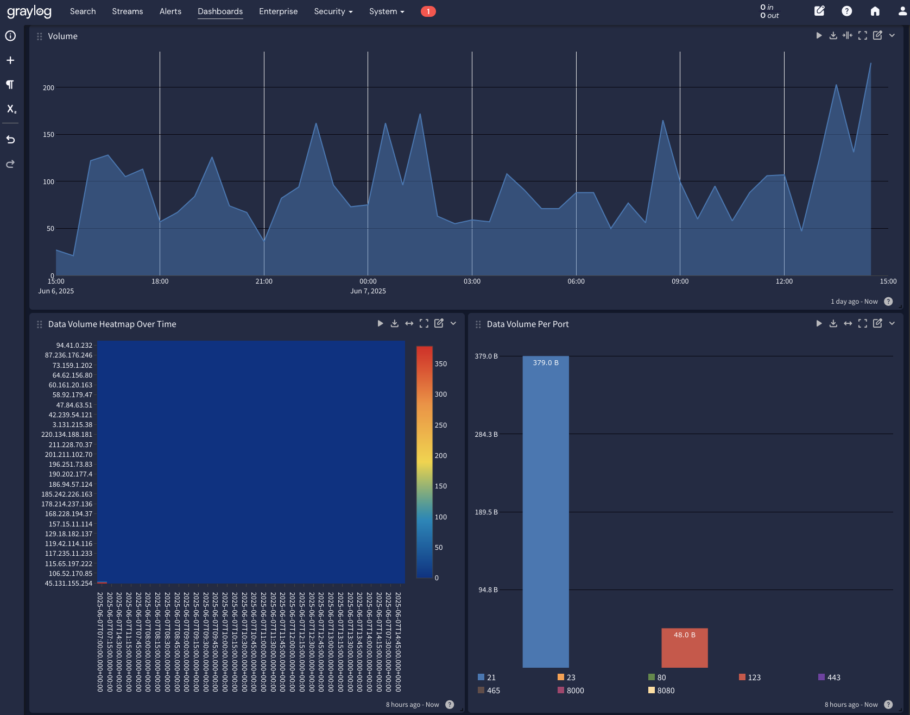
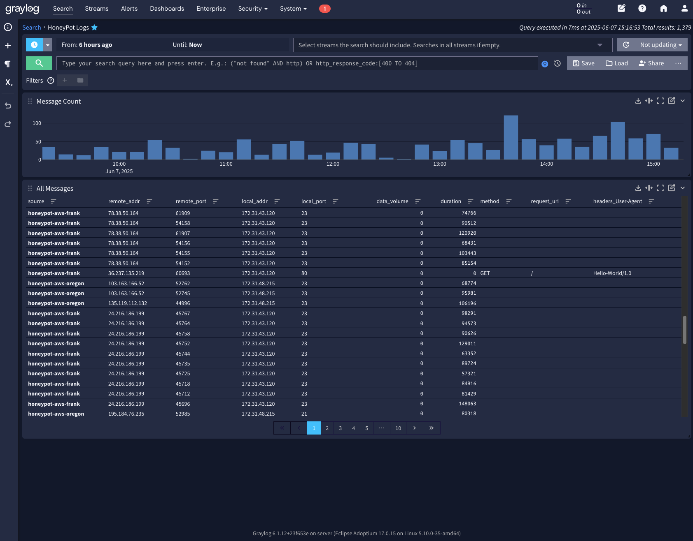

# Tripwire - A Honeypot and Log Aggregation System

## Overview

Tripwire is a multi-protocol honeypot system designed to capture network activity for security analysis. It includes servers for TCP, UDP, and HTTP traffic, forwarding captured data to a Graylog instance for centralized logging and analysis.

## Components

*   **`main.go`**: Orchestrates the honeypot system, reading configuration from `config.yaml`, and starting the port and HTTP servers. It forwards captured data to Graylog.
*   **`port-server.go`**: Handles TCP and UDP traffic. Listens on specified ports and captures basic connection statistics.
*   **`http-server.go`**: Handles HTTP traffic, capturing request details like method, URI, headers, and post data.
*   **`helper.go`**: Contains utility functions, including self-signed certificate generation.
*   **`example-config.yaml`**: Provides a sample configuration file for specifying Graylog address and listening ports.
*   **`docker-compose.yaml`**: Defines a Docker Compose configuration for setting up the honeypot system, including dependencies like MongoDB and Graylog.

## Configuration

The honeypot is configured using a YAML file (`config.yaml`). The following parameters are available:

*   `graylog_addr`: The address of the Graylog instance (e.g., "192.168.1.20:12201").
*   `http_servers`: A structured list of port and a tls flag.
*   `port_servers`: A structure list of port, protocol, and tls flag.

## Setup and Deployment

The easiest way to deploy Tripwire is using Docker Compose:

1.  **Server Deployment:**
    *   Docker and Docker Compose installed.
    *   Ensure `GRAYLOG_PASSWORD_SECRET` and `GRAYLOG_ROOT_PASSWORD_SHA2` are set in the environment (Use the example.env). 
    *   Run `docker-compose up -d` to start the honeypot system.

2.  **Clients:**
    *   Build the binary with `go build .` and copy the output binary and `config.yaml` to the target client.
    *   Modify `config.yaml` to specify the correct Graylog address and listening ports.
    *   Run the binary with `sudo ./tripwire`

## Data Analysis

Captured data is sent to Graylog, where it can be analyzed using the Graylog web interface. You can create dashboards and alerts to monitor network activity and identify potential threats.

  
  

